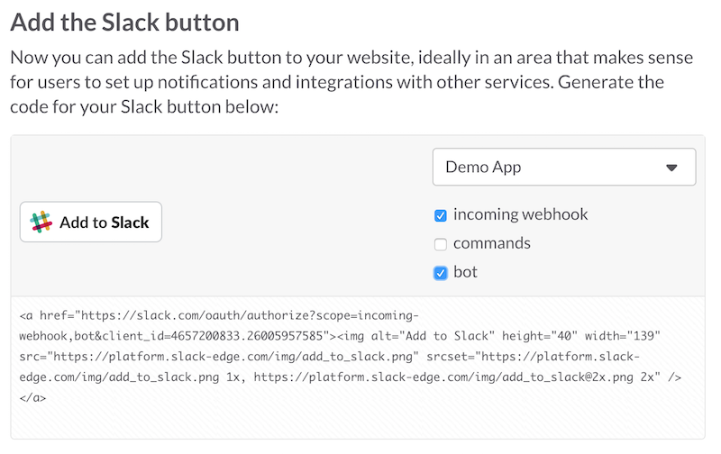

## Slack Button Integration Basics

### Make a Team

Sign up at [slack.com](https://slack.com), my team is _dblockdotorg.slack.com_.

### Create a New Slack App

This is something done in Slack, under [New Application](https://api.slack.com/applications/new). Make the redirect URL `http://localhost:4567`.

#### Client ID and Secret

Note the *Client ID* and *Client Secret* and export them into ENV.

```
export SLACK_CLIENT_ID=... SLACK_CLIENT_SECRET=...
```

#### Bot User

Add a *Bot User* with a default username.

### Slack Button

Follow the *Add the Slack Button* link. Check *bot*.



Copy-paste the slack button code into an index.html file. See [index.html](06-index.html) for an example.

### Gemfile

```ruby
source 'http://rubygems.org'

gem 'http'
gem 'faye-websocket'
gem 'eventmachine'
gem 'slack-ruby-bot'
gem 'sinatra'
```

### Service Implementation

```ruby
require 'http'
require 'json'
require 'faye/websocket'
require 'eventmachine'
require 'sinatra'

Thread.new do
  EM.run do
  end
end

get '/' do
  if params.key?('code')
    rc = JSON.parse(HTTP.post('https://slack.com/api/oauth.access', params: {
      client_id: ENV['SLACK_CLIENT_ID'],
      client_secret: ENV['SLACK_CLIENT_SECRET'],
      code: params['code']
    }))

    token = rc['bot']['bot_access_token']

    rc = JSON.parse(HTTP.post('https://slack.com/api/rtm.start', params: {
      token: token
    }))

    url = rc['url']

    ws = Faye::WebSocket::Client.new(url)

    ws.on :open do
      p [:open]
    end

    ws.on :message do |event|
      data = JSON.parse(event.data)
      p [:message, JSON.parse(event.data)]
      if data['type'] == 'message' && data['text'] == 'hi'
        ws.send({ type: 'message', text: "hi <@#{data['user']}>", channel: data['channel'] }.to_json)
      end
    end

    ws.on :close do |event|
      p [:close, event.code, event.reason]
      ws = nil
      EM.stop
    end

    "Team Successfully Registered"
  else
    "Hello World"
  end
end
```

See [serivce.rb](06-service.rb) for a working example.

### Run

Run the application with `bundle exec ruby service.rb` and open index.html in a browser to register the app.


